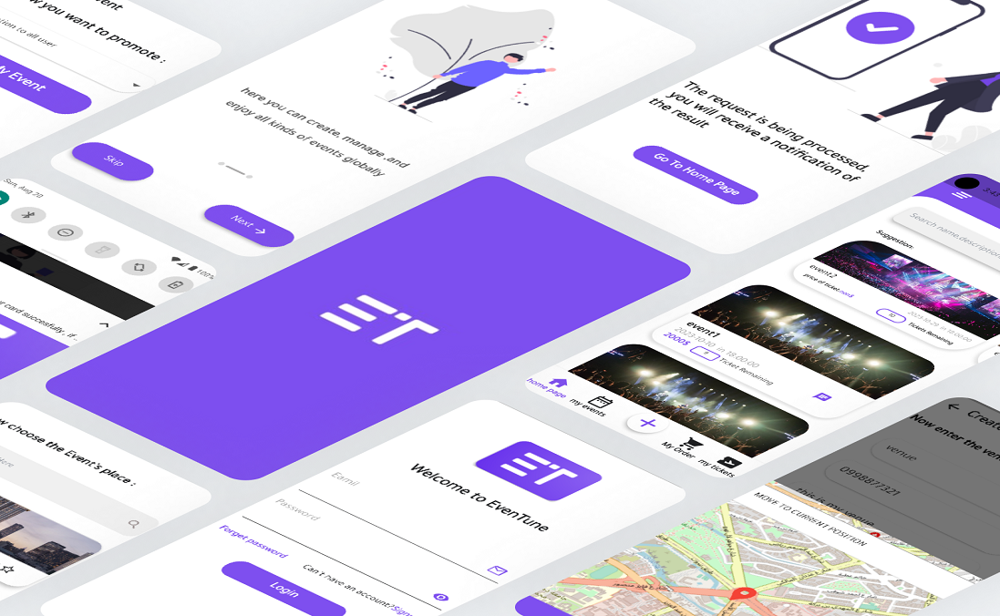

# :sparkles::sparkles: EvenTune
Eventune is a comprehensive event management application that streamlines the planning and execution of events. Whether you're organizing a large conference or a small social gathering, Eventune has everything you need to make your event a success.

## Features

### User Features:
1. **Explore Public Events**: Browse and explore all public events.
2. **Search Events**: Search for any public event by various properties.
3. **Create Events**: Create both public and private events.
4. **View Attendees**: See the list of attendees for your created events.
5. **Social Media Sharing**: Share your events on social media platforms.
6. **Book Events and Purchase Tickets**: Book events and buy tickets directly through the app.
7. **Event Promotion**: Promote your events using pre-made promotional plans.
8. **Event Preparation**: Prepare for your events directly through the app.
9. **Join Event Discussions**: Participate in discussions related to events.
10. **Manage Reservations**: View, accept, or reject pending reservations and provide reasons for rejection if needed.
11. **Venue Management**: Take venues offline in case of any issues.

### Admin Features:
1. **Manage Users**: View all registered users.
2. **Manage Event Venues**: Add, remove, and update event venues.
3. **Send Event Updates**: Send updates to users about any event.
4. **Manage Preparation Stores**: Add, remove, and update preparation stores.
5. **Monitor and Analyze**: View statistics and monitor the overall flow of the application.
